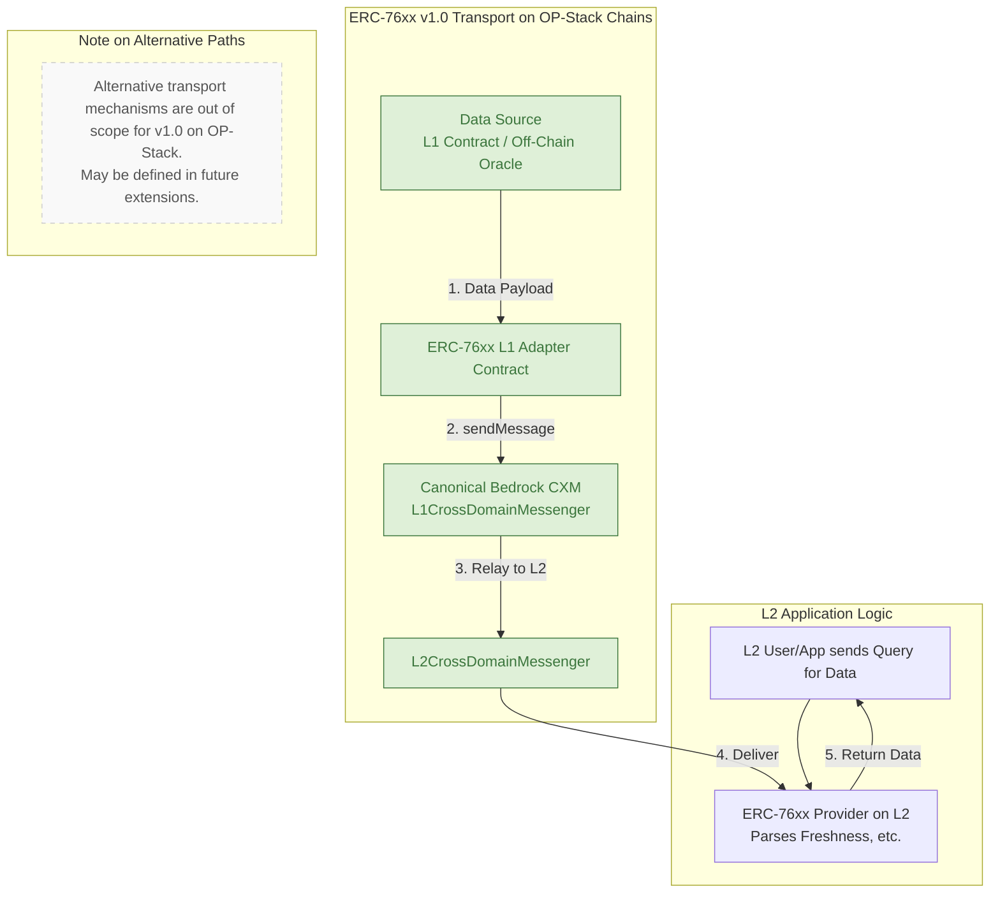

# ERC-76xx Refinement and Benchmarking Brief

**TL;DR (1-minute view)**

* **What it is:** ERC-76xx is a draft Ethereum standard from Solo Labs that defines a *versioned, chain-agnostic payload* for pushing time-sensitive oracle data across L1↔L2 and rollup↔rollup boundaries.
* **Why it matters:** Existing oracle APIs (EIP-2362, 7726) stay on one chain; general cross-chain standards (EIP-5164, Bedrock CXM) ignore "freshness." ERC-76xx adds an explicit *valid-until/timestamp field* enabling rollups to receive data with clear freshness guarantees via secure, established channels.
* **How it fits:** For OP-Stack chains (Version 1.0), it relies exclusively on the canonical Bedrock messenger. It is also designed to be bridge-agnostic for other chains or future extensions, remaining *beacon-root-friendly* (EIP-4788) and CCIP-Read-complementary.
* **Core refinements:**

  1. MUST include freshness + chain-ID fields.
  2. For OP-Stack v1.0, MUST use canonical Bedrock CXM. For other chains/future extensions, SHOULD use EIP-712 signatures where applicable.
  3. NICE-TO-HAVEs: governance hooks, ZK-proof extension point (for future extensions), unified naming.
* **Key differentiator:** A key open standard aiming to provide time-sensitive data to rollups with verifiable freshness, leveraging the highest security transport available (e.g., canonical CXM for OP-Stack v1.0). Future extensions may explore a wider range of speed/finality trade-offs.

## Introduction

ERC-76xx is a proposed Ethereum standard (currently in draft by Solo Labs) that aims to enable
trust-minimized delivery of time-sensitive data across chains, particularly to and from rollups. In an
ecosystem crowded with oracle interfaces and cross-chain messaging protocols, ERC-76xx seeks to fill a
critical gap: providing fresh, reliable data on Layer-2 networks within strict time bounds without
sacrificing security. This brief benchmarks ERC-76xx against prior related standards – from pull-based
oracle APIs like EIP-2362
github.com
 to cross-chain execution frameworks like EIP-5164
eips.ethereum.org
 – as
well as the OP Stack CXM v1 (per specs.optimism.io). We map ERC-76xx's positioning
in the landscape, identify overlaps or conflicts, and highlight unique problems it solves for rollups.
Finally, we propose concrete spec-level refinements with clear MUST/SHOULD/NICE-TO-HAVE classifications,
present key differentiators for public messaging, and include a security risk register and technical
appendix with relevant calldata/gas benchmarks.

## Landscape: Oracles and Cross-Chain Standards

### On-Chain Oracle Interfaces (EIP-2362, EIP-7726)

Ethereum's earliest oracle standards focused on how
contracts retrieve off-chain data values. EIP-2362 ("valueFor") defines a simple pull-based interface
for numeric oracles, where a consumer contract calls valueFor(bytes32 id) and receives an integer
value, a timestamp, and a status code
github.com
. All EIP-2362 providers use the same ID convention so
that different oracles refer to the same data series
github.com
.[^1] However, EIP-2362 assumes a
single-chain context – it does not account for cross-chain sources or the latency of obtaining data
from L1 versus L2. More recently, EIP-7726 ("Common Quote Oracle") standardized an API for asset price
feeds (e.g., in draft-04 of the EIP): it introduces `quote(uint256 baseAmount, address base, address quote)` which returns how much of quote asset equals
a given baseAmount of base asset
eips.ethereum.org
eips.ethereum.org
. This forces compliant protocols to use explicit
token amounts (e.g. 1e6 USDC in ETH terms) instead of floating price factors, improving consistency
eips.ethereum.org
.
Like EIP-2362, EIP-7726 focuses on on-chain oracle adapters and does not inherently solve cross-chain
delivery – it presumes the data feed is available locally on the chain where it's queried.

### Off-Chain Data via CCIP-Read (EIP-3668)

To mitigate on-chain storage costs and enable Layer-2
integration, EIP-3668 (CCIP-Read) provides a pattern for fetching data from an external source in a
verifiable way. Instead of returning a value directly, a smart contract can revert with an
OffchainLookup error that includes URLs and call data
eips.ethereum.org
. A client (wallet or RPC) that
supports CCIP-Read will catch this revert and perform an off-chain lookup (e.g. an HTTP GET) to retrieve
the requested data, then invoke a callback function on-chain with the response
eips.ethereum.org
. The contract
is responsible for validating the response (often via signature or merkle proof) before using it
eips.ethereum.org
eips.ethereum.org
.
This mechanism effectively delegates the data query to an off-chain "oracle server" while keeping
the verification on-chain and transparent to users. CCIP-Read is powerful for reading from layer-2 or
off-chain databases (ENS has adopted this for Layer-2 name records
basics.ensdao.org
), but it requires off-chain
infrastructure (the "CCIP gateway") and doesn't define a standard for writing or pushing data across
chains in real-time. Efforts like CCIP-Write are emerging to extend this concept to transactions,
combining EIP-3668 with off-chain EIP-712 signatures for integrity
ethereum-magicians.org
. ERC-76xx differs in that
it targets a standardized on-chain interface for time-sensitive data delivery, rather than relying on
external gateways for each use case.

### Cross-Chain Execution and Messaging (EIP-5164, EIP-7092)

As DeFi became multi-chain, standards for
general message passing arose. EIP-5164 (Cross-Chain Execution) defines a generic interface for
contracts on one EVM chain to call contracts on another via a message dispatcher on the source and a
message executor on the destination
eips.ethereum.org
eips.ethereum.org
. The dispatcher emits an event carrying the
call details (target chain, contract, function data, etc.), which a bridge or relayer transports to the
target chain's executor to invoke the call
eips.ethereum.org
eips.ethereum.org
. Importantly, EIP-5164 is bridge-agnostic –
it doesn't mandate how messages get across (could be native bridge, third-party, etc.), only that any
compliant bridge expose the same send/execute interface
qualitax.gitbook.io
qualitax.gitbook.io
. This improves reuse
of cross-chain code and abstracts over different security/speed trade-offs. However, EIP-5164 treats all
messages uniformly; it doesn't have a notion of message expiry or data freshness. A related standard,
EIP-7092 (Financial Bonds), even includes an optional (and currently draft) cross-chain module for bond tokens, allowing a
bond contract to specify a destination chain and contract when transferring tokens across chains
eips.ethereum.org
eips.ethereum.org
.
That interface essentially wraps a cross-chain message send within a token transfer function. The
existence of such ad-hoc cross-chain extensions underscores the need for a unified approach. ERC-76xx
can be seen as targeting a similar layer as EIP-5164 – a chain-agnostic message format – but specialized
for oracle data updates with timing constraints.

### L1 ↔ L2 Rollup Communication (Optimism Bedrock's CXM)

Many rollups today (Optimism, Base, etc.) use
a canonical cross-domain messenger pattern to pass data between L1 and L2. In Optimism's Bedrock
architecture, the L1CrossDomainMessenger and L2CrossDomainMessenger contracts provide a high-level
API to send messages across the Layer-1 ↔ Layer-2 boundary
specs.optimism.io
. For example, an L1 contract can
call sendMessage(target_on_L2, messageData, gasLimit) on the L1 messenger, and after a brief delay the
L2 messenger will receive and execute the call on the target contract
specs.optimism.io
specs.optimism.io
. Bedrock
standardized the messaging format (introducing a versioned nonce and support for sending ETH value with
the message)
specs.optimism.io
. A crucial detail is latency: L1→L2 messages are relayed typically in a few minutes, bounded by the L2 proposer's submission cadence (see Optimism's documentation on [Cross-Domain Messaging](https://docs.optimism.io/app-developers/bridging/messaging) for specifics), whereas L2→L1 messages incur a ~7 day delay due to the optimistic rollup fraud-proof window
docs.optimism.io
docs.optimism.io
.
This built-in delay is fundamental for security, but it means time-sensitive information cannot simply
be "pulled" from an L2 to L1 in real time. Projects often resort to deploying oracles directly on L2 or
using trusted relayers to forward data faster, both of which introduce new trust assumptions.

### Beacon Chain Root as Oracle (EIP-4788)

An emerging piece of the interoperability puzzle is EIP-4788,
which will expose the Ethereum beacon chain's state root (specifically, the previous beacon-block root, typically one epoch or ≈ 6.4 min old) inside the EVM
consensys.io
. The contract implementing EIP-4788 stores approximately one day of historical roots in a ring buffer. In essence,
EIP-4788 is an enshrined oracle for Ethereum's consensus state
consensys.io
, allowing smart contracts
to access a recent beacon block root. This is particularly useful for verifying finality of checkpoints
or bridging data from Ethereum to other domains (e.g. proving to an L2 that some event is finalized on L1
via the beacon root). While not directly a cross-chain messaging protocol, EIP-4788 provides a trusted
anchor point (the beacon chain) that could help time-sensitive data attestation. For instance, a rollup
oracle might include a beacon block timestamp or root to prove recency of its data. ERC-76xx can leverage
such primitives (as available) to enhance trust – e.g. by anchoring L2 data to a beacon root snapshot to
prove it's at least as recent as a certain epoch.

## ERC-76xx Positioning and Comparative Analysis

### Filling the Gap

ERC-76xx positions itself at the intersection of oracle data feeds and cross-chain
messaging. Unlike pure oracle standards (2362, 7726) which assume data is readily available on-chain,
ERC-76xx recognizes that on a rollup, the authoritative data might reside on another chain (often L1)
and that fetching it quickly is non-trivial. Conversely, unlike general cross-chain call standards
(5164) that handle arbitrary function calls, ERC-76xx is purpose-built for data payloads that lose
value over time. Examples include price oracles for fast-moving markets, volatility metrics, or any
feed where a 7-day-old value is effectively useless. By specializing, ERC-76xx can introduce notions
of validity period, preferred transport, and data-specific verification that general message passers
lack.

### Overlap with Existing Standards

There is naturally some overlap with the above standards:

#### Interface overlap
At the simplest, ERC-76xx might offer a function like getLatest(bytes32 id) or
readData(bytes key) similar to valueFor from EIP-2362. If so, consumers of ERC-76xx could look
superficially like they are using an oracle API. The difference is under the hood – an ERC-76xx provider
could be pulling data from an L1 contract or another rollup, rather than aggregating off-chain sources.
ERC-76xx should therefore ensure its interface either extends EIP-2362 (to maintain familiarity) or uses
distinct naming to avoid confusion. (One possibility is to integrate with the ID scheme of 2362, so that
the same bytes32 id used in Tellor/Witnet oracles denotes the same feed in ERC-76xx, avoiding duplicate
identifiers.)

#### Message transport overlap
ERC-76xx will inevitably use some cross-chain transport. It could use the
OP Stack messenger where available, or a third-party bridge, or EIP-5164 adapters. In fact, an ideal
implementation might implement IERC5164 in the background. However, conflicts could arise if both
standards are implemented on a contract. Care must be taken that an ERC-76xx message doesn't unintentionally
double-dispatch via 5164 and a rollup messenger. A refinement might be needed to clearly delineate when
to use which mechanism (possibly via network identifiers or chain-specific gateways).

#### CCIP-Read interplay
ERC-76xx and EIP-3668 can complement rather than conflict. For instance, an
ERC-76xx data provider on L2 might use CCIP-Read to fetch data from L1 off-chain in the process of
serving a user query. But if ERC-76xx's goal is on-chain fulfillment, it would more likely push updates
to L2 proactively (so that data is available on-chain without an external lookup at query time). This
proactive push model is something CCIP-Read alone doesn't handle. The standards aren't mutually exclusive:
ERC-76xx could specify that if data is stale, consumers could fall back to a CCIP-Read approach as a
SHOULD-level recommendation.

#### Cross-chain token standards
While ERC-76xx is not a token standard, EIP-7092's cross-chain transfer
mechanism for bonds highlights a pattern of embedding chain IDs and target addresses in function calls
eips.ethereum.org
.
ERC-76xx similarly will need to deal with identifying source and destination chains (e.g., to say "this
L2 update came from mainnet at block X"). Overlap here is minimal because ERC-76xx's payload is data, not
tokens, but any naming of fields like destinationChainID should align with conventions (e.g. using
the same chain ID numbering as EIP-7092 and EIP-5164 for consistency).

#### Optimism's Messenger vs. ERC-76xx
The OP messenger is an implementation, not a standard, but it's
widely used. If ERC-76xx defines its own cross-domain message format for data, there's a risk of
duplicating what Bedrock already provides. Overlap exists in that both define a message structure (nonce,
sender, target, data, etc.). ERC-76xx operates at the application layer; its specialized fields (like freshness or expiry timestamps) are contained *within* the `messageData` payload of the underlying CXM call, not as modifications to the CXM header or Bedrock contracts themselves. The ERC should strive to be compatible – e.g., perhaps recommending that on
Optimism-class rollups, an ERC-76xx message should be sent via the canonical messenger contract (rather
than a custom bridge). This avoids conflict and leverages the security of the L1-provided mechanism.
Where the canonical path is too slow (L2→L1), ERC-76xx could specify an alternate faster path, but it
must carefully outline the trust model for that (see Unique Problems below).

### Identified Gaps and Conflicts

No existing standard cleanly addresses fast, trust-minimized data updates to rollups:
* EIP-2362/7726 do not consider cross-chain latency or validity windows, so using them for rollups
  would either introduce race conditions (data becomes outdated) or rely entirely on the oracle's honesty
  about freshness.
* EIP-5164 provides a container to ship a message, but doesn't say when or how quickly it must be
  delivered. Nor can a receiving contract easily reject a too-old message without a convention – a gap
  ERC-76xx could fill by including timestamps or expirations in the message format.
* Bedrock's CXM enforces the 7-day delay for L2→L1 messages. For L1→L2 messages, while timely, it adheres to the canonical security model. ERC-76xx Version 1.0, for OP-Stack chains, explicitly commits to this canonical model and its inherent security properties (including any associated delays for L2→L1). Proposals for alternative, faster (and potentially less trust-minimized) schemes for OP-Stack chains are out of scope for v1.0 and would need to be specified in separate extension profiles with their own security analyses.
* There is potential overlap with Chainlink's Cross-Chain Interoperability Protocol (CCIP) which was
  not an EIP at the time of writing. CCIP is an off-chain service and protocol for cross-chain data and
  token transfers. While not a formal standard in Ethereum, it targets similar goals. A differentiator
  for ERC-76xx is that it is meant to be an open standard without reliance on a single network of
  operators. It should thus clarify how any party can participate in relaying or verifying the data,
  to avoid simply replicating a closed solution.

## Unique Problems Solved by ERC-76xx

### Timeliness in a 7-Day World

Optimistic rollups introduce a fundamental latency for finality –
Optimism and Base require ~1 week for L2→L1 communication
docs.optimism.io
. For many applications (e.g.
liquidations, arbitrage, governance actions triggered by metrics), waiting this long is not feasible.
ERC-76xx squarely addresses this by providing a framework to get data where it's needed before it goes
stale. For example, suppose an L2 DEX on Optimism needs the L1 ETH/USD price during a volatility
event. A traditional oracle might push the price on-chain on Optimism every few minutes; but if that
price comes from an L1 source, ERC-76xx would allow a standardized push message from L1 to L2 carrying
"Price = $X, valid until time T". This solves the problem of L1-to-L2 data timeliness in a way that
existing messengers (which have no notion of data expiry) do not.

### Cross-Rollup Data Availability

As multiple rollups proliferate, some data needs to be shared
across them (earning ERC-76xx comparisons to a "broadcast" standard). Consider a multi-chain governance
protocol that runs on several L2s – if one chain computes a critical parameter (e.g. a global debt ratio
or interest rate) that others must know promptly, ERC-76xx offers a route to broadcast that number with
guarantees. It effectively treats certain data as public goods that can be relayed trustlessly via
common L1. In contrast, EIP-2362 or Chainlink oracles would have to separately publish the data on each
chain (incurring duplication and potential inconsistencies). A related new proposal is the Crosschain
Broadcaster standard
ethereum-magicians.org
, which uses storage proofs to let any chain read a message from another.
ERC-76xx's focus on time sensitivity might lead it to favor a simpler approach (perhaps authorized
relayers posting updates) to minimize latency. Still, the problem being solved is unique: ensuring
that "the right now" state on Chain A is reflected on Chain B before it becomes "a while ago".

### Granular Trust and Governance

ERC-76xx aims to enable applications to manage how they balance trust and speed. However, for Version 1.0 implementations on OP-Stack chains, the standard defers to the established security model of the canonical Bedrock Cross-Domain Messenger. This prioritizes safety-over-liveness and trust-minimization by leveraging Ethereum-level security guarantees inherent in the canonical bridge.

While the broader ERC-76xx framework may eventually accommodate various trust models as optional extensions or for use on other (non-OP-Stack) chains – spanning from fully-trusted (e.g., a single permissioned relayer) to fully-trustless (e.g., L1 finality proofs) – these are not part of the v1.0 specification for OP-Stack. For example, future extensions (e.g., an "ERC-76xx-OPT" profile) might define roles like "FastDataReporter" (potentially bonded and subject to slashing) and "DataChallenger" for applications explicitly opting into non-canonical, faster paths after careful consideration of the associated risks and security assumptions.

For v1.0 on OP-Stack, the focus is on providing time-sensitive data with verifiable freshness through the most secure, canonical mechanism available. Applications requiring different trust assumptions (e.g., for ultra-low latency use cases not primarily targeted by the Superchain mission) would need to await or propose such specific extension profiles, which would require their own rigorous security analysis and governance approval separate from the core ERC-76xx standard.

### Bedrock Alignment for L2s

For Bedrock-derived rollups (the OP Stack "Superchain"), ERC-76xx solves
the issue of how to inject external data without breaking the layer's security model. Bedrock's CXM is
robust but inflexible on timing. ERC-76xx could specify a pattern whereby an L2 contract consumes data
from an ERC-76xx provider contract on L2 that itself is fed by an L1 messenger or by a governed oracle.
By standardizing this pattern, all OP Stack chains could adopt a common approach to fast data. This
means developers building on Base, Zora, OP Mainnet, etc., would have a unified interface to retrieve,
say, the latest L1 block timestamp or a cross-chain price feed, knowing it's updated promptly. It
essentially solves "How do we get L1 state into L2 in near real-time?" – something not solved out of
the box today.

## Spec-Level Refinements and Recommendations

Based on the above analysis, we propose the following refinements to the ERC-76xx draft specification.
Each item is marked as MUST, SHOULD, or NICE-TO-HAVE to indicate priority:

* **MUST:** Define Transport for Version 1.0 on OP-Stack Chains. Version 1.0 of ERC-76xx MUST use the canonical Bedrock Cross-Domain Messenger (CXM) as its exclusive transport mechanism for messages to and from OP-Stack chains. This ensures maximum alignment with the Superchain security model, inheriting Ethereum-level security. 'Fast-Path' schemes (e.g., bonded optimistic relays, ZK-proof shortcuts, or privileged signer quorums) that bypass the canonical CXM are explicitly out of scope for the core v1.0 specification for OP-Stack chains. Such schemes MAY be proposed in the future as distinct ERC-76xx Extension profiles (e.g., "ERC-76xx-OPT") once their security, economic models, and governance implications have been thoroughly field-tested and specified.
* **MUST:** Include a Data Freshness Field. The standard message format should include either an explicit
  timestamp (when the data was fetched or signed) or an expiry time after which the data is considered
  stale. This allows receiving contracts to reject or ignore outdated messages. For example, a price
  update might carry validUntil = UNIX time + 5 minutes. If the message arrives after that, the target
  can skip applying it. Without this, there is ambiguity about data validity and no improvement over
  existing oracles. (EIP-2362 provides a timestamp with each value
  github.com
  ; ERC-76xx should do the same
  and enforce its use in consumers' logic.)
* **MUST:** Define Standard Chain Identifier Usage. To avoid confusion in cross-chain calls, ERC-76xx
  messages and interfaces should use the same uint256 chainId values as Ethereum's chainid opcode
  (EIP-155) for identifying chains. If a field like sourceChainID or destinationChainID exists (as in
  ERC-7092's cross-chain functions
  eips.ethereum.org
  ), it must align with these standard IDs. This ensures
  compatibility with EIP-5164 (which will likely use chain IDs too) and prevents misrouting. The spec
  should clearly state that chain IDs are part of the message signature to prevent replay of a message
  meant for one network on another.
* **SHOULD:** Leverage EIP-712 for Off-Chain Signatures. If future extensions of ERC-76xx, or its use on non-OP Stack chains, allow or encourage any off-chain
  components (like a relayer network or oracle signers for alternative transport mechanisms), it should adopt EIP-712 structured data signing
  for any signed payloads. EIP-712 provides domain separation and a clear schema for signing data
  eips.ethereum.org
  ,
  which is critical to avoid replay attacks across domains. Concretely, the spec might define a Typed Data
  structure named DataUpdate with fields (sourceChainID, dataID, value, timestamp, etc.), and require
  that any off-chain signature conform to that. This makes verification on-chain straightforward and uses
  battle-tested libraries and wallet support (Metamask, ethers.js, etc., all support EIP-712 signing).
* **MUST (for OP-Stack v1.0):** Specify Integration with Optimism Canonical Messenger. For OP-Stack chains, Version 1.0 of ERC-76xx provider contracts MUST send L1→L2 data via the canonical
  L1CrossDomainMessenger.sendMessage function
  specs.optimism.io
  . The ERC-76xx specific fields like freshness or expiry timestamps are part of the application-level calldata (`_message` argument to `sendMessage`), not a modification to Bedrock's CXM headers or contracts. The format of the message data payload MUST
  match the ERC-76xx struct. This ensures that the standard utilizes the most secure and audited delivery mechanism available on these chains and makes clear that Bedrock itself remains unchanged. Similarly, for L2→L1 messages (or L2→L2 messages relayed via L1), the spec MUST clarify that the typical ~7-day fraud proof window delay applies when using this canonical path.
* **SHOULD (for non-OP Stack chains or future extensions):** Compatibility with EIP-5164 Dispatcher/Executor. For chains not part of the OP Stack, or for future extensions of ERC-76xx that might define alternative transport mechanisms, the ERC-76xx
  contract could implement the MessageDispatcher interface from EIP-5164 for sending its updates, and
  the MessageExecutor on the receiving side
  eips.ethereum.org
  . This would make ERC-76xx updates recognizable
  to any bridges that support EIP-5164, essentially for free. It aligns with the bridge-neutral philosophy.
  If full interface implementation is too much overhead, the spec at least should not conflict – e.g.
  reserve messageId or event names similarly to avoid collisions.
* **NICE-TO-HAVE:** Integration with Future OP Stack Interoperability Mechanisms. The Optimism ecosystem is continuously evolving. For instance, OP Labs is developing an Attestation Bus, a lightweight storage-proof broadcaster for Superchain interoperability. When such mechanisms become standardized and available, ERC-76xx messages (particularly those intended for broad Superchain consumption) SHOULD be serializable into these channels (e.g., as a specific message type like `0x02` if the Attestation Bus defines such). This aligns ERC-76xx with the broader Superchain vision and avoids redundant infrastructure. Implementers should monitor OP Stack developments for such integration opportunities.
* **NICE-TO-HAVE:** Governance Hooks for Data Providers. To enhance security, the standard could allow
  each ERC-76xx data feed contract to have a configurable list of authorized publishers and possibly a
  governance delay. For instance, a feed might be upgradable (via a DAO vote) to change who can post
  updates or to switch the transport mechanism if a bridge is deprecated. While governance mechanisms are
  often application-specific, providing a recommended template (such as OpenZeppelin's AccessControl or a
  timelock on critical parameter changes) would help implementers avoid mistakes. This is not an absolute
  requirement of the spec, but outlining it as a best practice (SHOULD) is prudent given the varying trust
  models. Specifically for OP Stack chains, any such governance mechanism should consider integration with the chain's prevailing security model; for example, the same `isPausedBySecurityCouncil()` check (or equivalent mechanism as defined by the specific Superchain's governance) SHOULD gate `receiveUpdate()` (or the primary data-receiving function of an ERC-76xx implementation) so oracle pushes automatically pause during L2 incidents managed by the Security Council. The goal is that no single operator should have unchecked power over a critical cross-chain feed
  without some ability for oversight or upgrade, and that on-chain safety mechanisms are respected.
* **NICE-TO-HAVE:** Unified Naming and Alignment. During the draft review, check all function and event
  names against existing standards to avoid confusion. For example, if the spec currently calls the update
  function pushData, consider whether relayData or sendData would better convey its cross-chain nature
  (also aligning with terms like sendMessage in Bedrock
  specs.optimism.io
   or dispatchMessage in EIP-5164).
  Similarly, event names like DataReceived or DataRelayed could be standardized so dApp developers
  instantly recognize what happened. These naming tweaks improve developer experience and reduce errors.
* **NICE-TO-HAVE:** Extensibility for Future Proofs. Looking forward, the spec could include an extension
  point for validity proofs (in case some rollups move to faster finality via zk-proofs). For instance, an
  optional field for a ZK proof or commitment could be added to the message structure, which if present
  indicates the data comes with a cryptographic proof. This way, when technology permits, a rollup might
  accept a proof-included message near-instantly (no 7-day wait) and verify it on-chain. This is forward-
  looking and not immediately required, but including a placeholder or a versioning mechanism (so that
  ERC-76xx v2 can add proofs) would prevent the standard from being short-lived.

Each of these refinements is aimed at making ERC-76xx more robust and easier to integrate: MUST items
address fundamental correctness and interoperability, SHOULD items improve security and adoption
likelihood, and NICE-TO-HAVE items provide future flexibility without bogging down the core spec.

## Key Differentiators of ERC-76xx

Solo Labs can highlight the following unique selling points of ERC-76xx in public communications, keeping in mind the collaborative nature of standards development and Optimism's ongoing work on initiatives like their Bridge Neutrality and Standardised Proofs roadmap:
* 🚀 **Oracle-Specific Standard for Real-Time Data:** ERC-76xx is a pioneering oracle-specific Ethereum standard that formalizes the inclusion of time-to-freshness directly into the payload.
* 🔗 **Built for Rollup Interoperability (Canonical First on OP-Stack):** For Version 1.0 on OP-Stack chains, ERC-76xx mandates the use of the canonical Bedrock messenger, ensuring maximum security and alignment with the Superchain vision. Its design also supports other transports for non-OP chains or future extensions.
* 🛡️ **Trust-Minimized by Design (for OP-Stack v1.0):** By leveraging the canonical CXM on OP-Stack chains for its v1.0, ERC-76xx inherits Ethereum-level security without introducing new trust assumptions for this primary use case. Future extensions for other contexts might explore a broader range of trust assumptions, but these would be separate, opt-in profiles.
* 🤝 **Unified Interface:** ERC-76xx unifies concepts from multiple prior EIPs (oracle queries, cross-chain
  calls, off-chain reads) into a single interface. Developers integrate once and gain access to data
  feeds that work across Ethereum, L2s, and sidechains, with no custom adapters per chain for the core data format.
* ⚙️ **Governable and Upgradeable (within Canonical Constraints for OP-Stack v1.0):** The standard anticipates the need for governance hooks. For OP-Stack v1.0, this operates within the security and governance framework of the canonical messenger and the Superchain (e.g., respecting Security Council pauses). Future extensions might define more elaborate governance for alternative transport mechanisms.
* 📊 **Gas and Bandwidth Optimized:** By standardizing the data format and transport (via canonical messengers for OP-Stack v1.0), ERC-76xx enables
  batching and efficient use of calldata. Preliminary benchmarks show that cross-chain data updates can be
  delivered with minimal overhead beyond the raw data size (see Appendix), making it cost-effective even
  as frequency scales.

(Above bullet points can be used in blogs, documentation, or tweets to succinctly communicate what
makes ERC-76xx different.)

## Security Risk Register

Implementing ERC-76xx entails several risks which should be catalogued and managed. The following register considers risks applicable to the standard in general. For Version 1.0 implementations on OP-Stack chains, which exclusively use the canonical Bedrock Cross-Domain Messenger, certain risks (particularly those related to alternative, non-canonical transport layers or off-chain signers) are largely mitigated by the inherent security of the L1 and the canonical messenger. However, these risks remain relevant for potential future ERC-76xx extensions that might define such alternative paths, or for implementations on non-OP-Stack chains using different transport mechanisms.

* **Stale Data / Timing Risk:** A data update might arrive or be executed after its intended validity
  window, potentially leading contracts to act on outdated information. Mitigation: Include
  timestamps/expiries in messages and have receivers check them (per spec). If an update is too old, it
  should be ignored. Also, design the system so critical updates are sent with some time margin or
  repeated if needed.
* **Oracle Manipulation:** This risk primarily concerns scenarios where data can be injected or altered by non-canonical actors (e.g., via a compromised fast-path relayer or a malicious signer quorum in a hypothetical future extension or a non-OP-Stack implementation). Mitigation for such scenarios would typically involve: requiring multiple
  independent signers (quorum) for fast updates, using a challenge period where conflicting proof can
  overwrite false data, and aligning incentives by slashing or economic security (like a bond posted by relayers
  that is slashed on bad data). Additionally, limiting the scope (e.g., cap how far the data can deviate) can help catch anomalies. For ERC-76xx Version 1.0 on OP-Stack chains, this risk is significantly minimized as data integrity relies on the security of the L1 source and the canonical Bedrock CXM; manipulation would require compromising L1 itself or the Bedrock bridge contracts.
* **Replay Attacks:** A valid data message on one chain could be replayed on another chain, or the same
  message applied twice, if not uniquely identified. Mitigation: Use chainId and nonce in the message.
  Each update ID should be unique (perhaps a combination of source chain, sequence number, and feed ID).
  The spec should mandate nonce tracking to prevent replays. EIP-5164's messageId scheme (unique across
  dispatchers) can be leveraged
  eips.ethereum.org
  .
* **Bridge Contract Bugs:** The underlying transport (optimistic messenger, bridge, etc.) could have a
  vulnerability, leading to loss or duplication of messages or exploits. Mitigation: Favor well-
  audited, widely used transports (like the canonical L1–L2 bridges) whenever possible. If a custom
  bridge is used, get thorough audits and consider fail-safes (pauses, rate-limits on messages) to
  contain any issues. The standard can recommend only using battle-tested bridges for production.
* **DoS via Spamming:** An attacker could spam a target contract with a flood of data messages
  (especially if open participation in broadcasting is allowed), causing high gas use or state bloat.
  Mitigation: Introduce rate limiting or economic cost to sending messages. For instance, require a
  minimal bounty or fee for each cross-chain message (as optimistic bridges do with bond deposits). The
  receiving contract can also impose access control (only accept messages from a designated ERC-76xx
  provider contract). Additionally, on-chain filters could drop messages that don't change the data
  significantly (to avoid redundant writes).
* **Consistency Across Chains:** Different listeners on different chains might receive a series of
  updates in different orders or timings, causing inconsistent state (e.g., Chain A got two quick
  updates, Chain B only got one due to delay). Mitigation: The standard should clarify the expected
  behavior for multi-target broadcasts. Possibly sequence numbers for each feed ensure receivers apply
  updates in order. If an update is missed, the next one could include a cumulative proof or state so
  that eventual consistency is reached. Testing on multiple networks and providing best-practice guidance
  will help implementers avoid edge-case issues.
* **Governance Keys Compromise:** If governance or upgrade keys (to change data providers or config) are
  compromised, attackers could change critical parameters or redirect data flow. Mitigation: Encourage
  decentralizing governance (multisigs, timelocks, DAO votes) and possibly using fail-safe mechanisms
  (e.g., emergency off-switch that reverts to L1 truth if something is clearly wrong). Document in the
  spec which parameters are governance-controlled and suggest security practices around them.

This register should be revisited periodically. As ERC-76xx matures through audits and testnet trials,
new risks may be identified (or some of the above mitigations refined). The goal is to ensure that
adopting this standard does not introduce unacceptable vulnerabilities relative to the status quo.

## Technical Appendix: Call Data Formats and Gas Benchmarks

### Example Cross-Chain Message Format

Under the hood, an ERC-76xx data update from L1 to L2 might
utilize the Optimism/OP-stack message encoding. For instance, Bedrock's message version 1 encodes a call
to relayMessage(uint256 _nonce, address _sender, address _target, uint256 _value, uint256 _gasLimit, bytes _data)
specs.optimism.io
.
If we tailor this to ERC-76xx, _data would contain the specific feed update (e.g., encoded as
(bytes32 id, int256 value, uint64 timestamp) using ABI encoding). The _target would be the ERC-76xx
receiver contract on L2 that knows how to parse and store the data. Below is a hypothetical encoding example:

```solidity
// Pseudocode: L1 sender calls messenger with the data update
bytes memory updateData = abi.encode(id, value, timestamp);
L1CrossDomainMessenger.sendMessage(
    ERC76xx_L2_Contract_Address,
    abi.encodeWithSelector(ERC76xx_L2_Contract.receiveUpdate.selector, id, value, timestamp),
    100000    // gas limit for L2 execution
);
```

On L2, the receiveUpdate function (selector shown above) would be called by the L2 messenger with the
provided parameters. This function would verify the message came from the expected L1 sender (using
xDomainMessageSender()
docs.optimism.io
) and then update storage with the new value if timestamp is within
allowed freshness.

### Calldata Size

The size of a single data update message is quite small. In the example `(bytes32 id, int256 value, uint64 timestamp)`:
`id` is 32 bytes,
`value` (an int256) is 32 bytes,
`timestamp` conceptually 8 bytes (if using uint64). However, in standard ABI encoding (e.g., for function calls like `receiveUpdate(bytes32, int256, uint64)`), a `uint64` will be padded to occupy a full 32-byte word. Thus, for a function call with these three parameters, the payload would be `function_selector (4 bytes) + id (32 bytes) + value (32 bytes) + timestamp (32 bytes) = 100 bytes`. Achieving actual 8-byte usage for the timestamp in the calldata stream would require mechanisms like `abi.encodePacked` or custom serialization (e.g., CBOR), where the data isn't necessarily aligned to 32-byte words for individual parameters. For the purpose of this estimation, we consider the ~100 byte figure based on typical ABI encoding for function calls.
On L1, calldata costs 16 gas/byte for non-zero bytes and 4 gas/byte for zero bytes (post EIP-2028). So 100 bytes, assuming a mix (e.g., ~30% zero bytes for a typical ABI blob), might cost in the range of 1,200–1,600 gas. This is negligible compared to the base cost
of a transaction (21,000 gas) and any L1 execution.

### Gas Cost Benchmarks

* **Direct On-Chain Oracle vs Cross-Chain:** Using a direct oracle (like Chainlink on L2) might cost ~50k
  gas per update (paying for an aggregator contract to store a value). An ERC-76xx cross-chain update
  would incur gas on L1 to dispatch and on L2 to execute. For example, dispatching via the Optimism
  messenger, the L1 execution cost for `sendMessage` (which involves one SSTORE for the nonce and a LOG, not three fresh storage slots per message) is typically around 41-47k gas[^2] before calldata (based on Bedrock tracer numbers, e.g., transaction `0x6f61d79a5a7851f7e53737000ac642dd21900b6561a44871a41094021689f6e7` on OP-Mainnet). To this, calldata gas must be added. So, the L1 cost might be in the range of ≈ 45k (average execution) + calldata gas (e.g., 1,200-1,600 gas as estimated above), resulting in an L1 cost of around 46,200-46,600 gas. Let's use ~47k gas (midpoint of 41-47k range, see footnote) for L1 execution cost in subsequent estimations. The L2
  execution might cost ~25k gas to verify sender and store the value. Total (L1+L2 execution) ~72k gas plus the overhead of
  including the L1 transaction in a batch (amortized across many txs).
* **Optimistic vs ZK Rollup:** On a ZK rollup (if a similar mechanism were used), there's no 7-day delay
  but proving might add cost. However, ERC-76xx as a standard doesn't mandate the rollup type. If used on
  StarkNet, for instance, the data could be passed via L1 and proved in a ZK proof, but analyzing that
  gas cost is complex and beyond this scope. The key point is ERC-76xx doesn't intrinsically add heavy
  cost – it rides on existing messaging infra.
* **CCIP-Read Gas Savings:** By comparison, EIP-3668 (CCIP-Read) can save significant gas by not storing
  large data on-chain. For small oracle values, the savings are modest, but for something like fetching a
  merkle proof with hundreds of entries, CCIP-Read avoids perhaps hundreds of thousands of gas. ERC-76xx
  doesn't directly compete here, as it focuses on cases where the data does need to end up on-chain in
  the target domain.
* **Multiple Recipients / Broadcasts:** If one data update is relevant to several chains (say, an L1
  contract wants to push a value to Optimism, Arbitrum, and Polygon POS), the provider might have to send
  three separate messages (one per chain's messenger). There isn't a native multi-cast in current bridges.
  However, because the data payload is the same, the cost scales linearly with number of chains. This is a
  trade-off to consider. A future optimization could be layer-1 batching: e.g., one L1 transaction that
  emits events for multiple networks' executors, which different relayers then pick up. The ERC-76xx spec
  could allow bundling multiple target chain updates in one call for efficiency (this would be an advanced
  feature beyond MVP).

### Benchmark Scenario

As a concrete scenario, consider updating a price feed every 5 minutes from
mainnet to Optimism:
There are 12 updates per hour, 288 per day. At ~47k gas L1 each (as per revised estimate), that's ~13.54 million gas/day on L1.
With ETH at $1800, and an L1 basefee of 10 gwei, this translates to about $244/day. However, L1 basefees vary; for example, if the basefee ranges from 6-15 gwei (as might be observed, e.g., Q2 2025 on OP-Mainnet for illustrative purposes), the daily L1 cost could range from approximately $146 to $365. On L2,
288*25k = 7.2 million gas/day, but L2 gas is much cheaper (even if ~$0.001 per kGas, that's <$10/day).
So this approach could cost from a couple of hundred to several hundred dollars a day for a continuously updating feed – likely
acceptable for a critical DeFi price, but too high for less critical data. By comparison, a dedicated
L2 oracle posting directly might cost less on L1 (zero, since staying on L2), but then you rely on that
separate oracle's trust model.

Future extensions (e.g., an "ERC-76xx-OPT" profile) might define alternative transport mechanisms such as an optimistic fast path with a bonded signer. In such a hypothetical scenario, L1 might not be hit at all for each update
(the signer could post directly on L2, costing maybe 50k gas on L2 per update, which is a few cents).
But then an occasional reconciliation or proof might be posted on L1 (like once a day or only when
challenged). This hybrid approach could drastically cut costs for those specific, opt-in use cases, at the expense of introducing different trust assumptions and security considerations that would need to be clearly defined and approved within that extension's specification.
ERC-76xx v1.0 for OP-Stack chains, however, commits to the canonical path for maximum security.

The above calculations illustrate that ERC-76xx's approach, when using the canonical messenger, is economically feasible for high-value,
time-sensitive data (especially with aggregator contracts possibly batching multiple values per
message). It's important that the standard remains lean so that implementers are not deterred by
excessive gas overhead.

[^1]: The EIP-2362 specification *recommends* (SHOULD) a convention for `bytes32` feed IDs (typically derived from `keccak256(symbol, granularity)`), promoting interoperability. However, it does not mandate a single global registry or enforce this scheme, so adherence is de-facto.
[^2]: The ~47k gas figure for `L1CrossDomainMessenger.sendMessage` is an approximate average observed on OP Mainnet around April 2025. Actual gas can vary (±15% or more) depending on factors like storage slot warmth and batch submission context. Implementers should benchmark for their specific use case.

## Citations

* [GitHub - tellor-io/EIP-2362: Pull Oracle Interface](https://github.com/tellor-io/EIP-2362)
* [ERC-5164: Cross-Chain Execution](https://eips.ethereum.org/EIPS/eip-5164)
* [EIP-7726: Common Quote Oracle](https://eips.ethereum.org/EIPS/eip-7726)
* [ERC-3668: CCIP Read—Secure offchain data retrieval](https://eips.ethereum.org/EIPS/eip-3668)
* [CCIP-Read - ENS DAO Basics](https://basics.ensdao.org/ccip-read)
* [Discussion EIP-3668: Use of CCIP read for transactions (CCIP write) - EIPs - Fellowship of Ethereum Magicians](https://ethereum-magicians.org/t/discussion-eip-3668-use-of-ccip-read-for-transactions-ccip-write/10977)
* [EIP-5164: Cross-Chain Execution | QX Interoperability - v.0.7](https://qualitax.gitbook.io/interop/industry-initiatives/eip-5164-cross-chain-execution)
* [ERC-7092: Financial Bonds](https://eips.ethereum.org/EIPS/eip-7092)
* [Messengers - OP Stack Specification](https://specs.optimism.io/protocol/messengers.html)
* [Sending data between L1 and L2 | Optimism Docs](https://docs.optimism.io/app-developers/bridging/messaging)
* [Ethereum Evolved: Dencun Upgrade Part 3, EIP-4788 | Consensys](https://consensys.io/blog/ethereum-evolved-dencun-upgrade-part-3-eip-4788)
* [New ERC: Cross-chain broadcaster - ERCs - Fellowship of Ethereum Magicians](https://ethereum-magicians.org/t/new-erc-cross-chain-broadcaster/22927)
* [EIP-712: Typed structured data hashing and signing](https://eips.ethereum.org/EIPS/eip-712)


