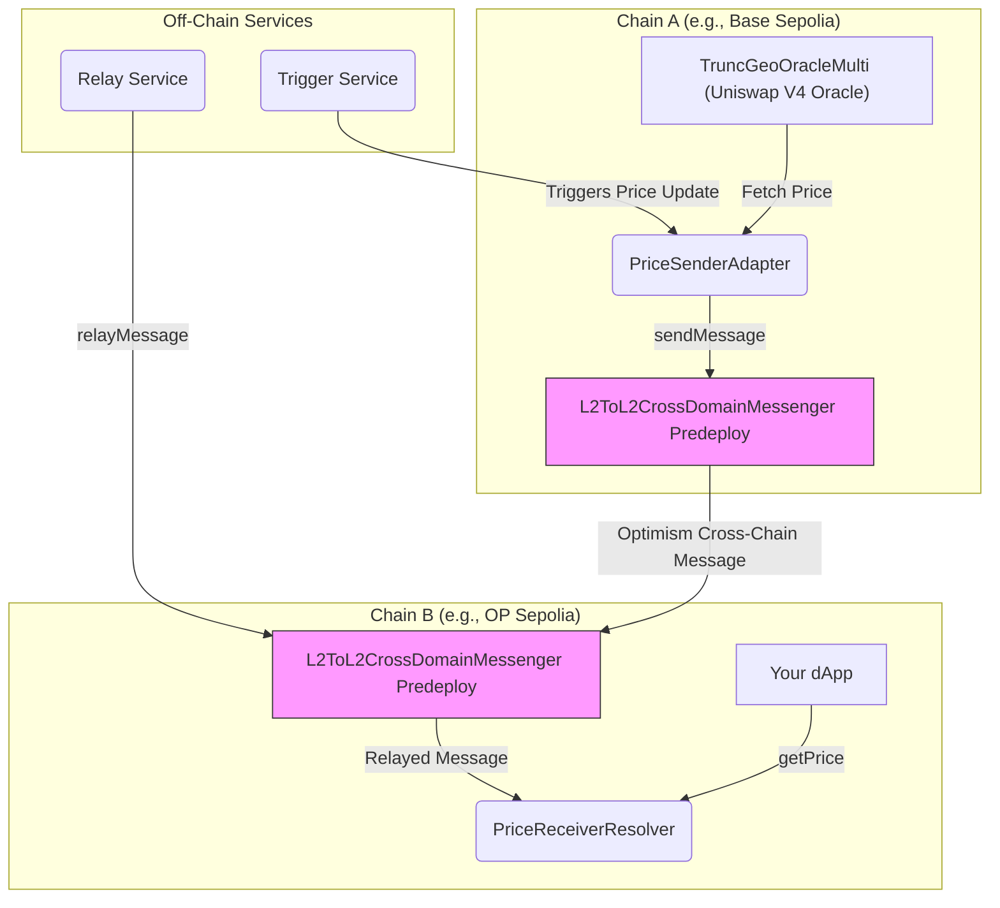

# 📡 AnyPrice — Unified Cross-Chain Oracle Access

**⚡ Fetch real-time asset prices from any chain, using a single call. Modular. Composable. No lock-in.**

## 🎯 Problem

Accessing up-to-date price oracle data across different blockchain ecosystems (especially L2s) is fragmented and complex. dApps on one chain (e.g., Optimism) often need price data for assets whose primary liquidity and reliable oracle source exist on another chain (e.g., a different OP Stack chain, or potentially Uniswap V4 on Ethereum L1 in the future). Standard solutions involve cumbersome bridging, custom relayers, or reliance on centralized oracle providers who may not support all desired chains or assets immediately.

## ✨ Solution: AnyPrice

AnyPrice is a cross-chain oracle framework enabling dApps on Optimism (or any L2) to fetch price data from remote chains *as if it were local*.

**Example:** You're on OP Sepolia. The asset you need to price only has a reliable Uniswap V4 oracle (`TruncGeoOracleMulti`) deployed on Base Sepolia.

**With AnyPrice, you just call:**

```solidity
// In your contract on OP Sepolia
CrossChainPriceResolver.resolvePrice("TOKEN_POOL_ID", baseSepoliaChainId); 
```

✅ You get a fresh, validated price from Base Sepolia.  
✅ Data sourced from a registered, chain-specific oracle adapter (`PriceSenderAdapter`).  
✅ Delivered securely and efficiently via Optimism's native L2-to-L2 messaging.

## 🔗 Hackathon Relevance (Optimism x Uniswap Interoperability)

AnyPrice directly addresses the hackathon theme by demonstrating powerful interoperability:

1.  **Optimism Native Messaging:** Leverages the canonical `L2ToL2CrossDomainMessenger` predeploy for secure and efficient data transfer *between* Optimism ecosystem chains (OP Stack L2s). This showcases a core piece of Optimism's interoperability infrastructure.
2.  **Uniswap V4 Oracle Integration:** Consumes price data from `TruncGeoOracleMulti`, a custom Uniswap V4 compatible oracle designed for multi-pool TWAP-like data with manipulation resistance (via truncated observations). This demonstrates accessing and utilizing next-generation Uniswap oracle data across chains.
3.  **Modular Design:** The adapter pattern (`PriceSenderAdapter`, `PriceReceiverResolver`) allows integrating *any* source oracle and potentially *any* messaging layer, promoting a composable cross-chain future.

## 🧱 How It Works

### 🛰 1. Source Oracle & Sender (Chain A - e.g., Base Sepolia)

*   A source oracle (here, `TruncGeoOracleMulti`, compatible with Uniswap V4 pools) provides price data.
*   The `PriceSenderAdapter` contract is deployed on Chain A.
*   When triggered (e.g., off-chain keeper), `PriceSenderAdapter`:
    *   Fetches the latest price from `TruncGeoOracleMulti`.
    *   Formats it into a message payload.
    *   Calls `sendMessage` on Chain A's `L2ToL2CrossDomainMessenger` predeploy.

### 🔁 2. L2-to-L2 Cross-Chain Messaging (Optimism Protocol)

*   The message from Chain A's messenger is routed to Chain B's (e.g., OP Sepolia) `L2ToL2CrossDomainMessenger`.
*   This relies on Optimism's underlying cross-chain communication infrastructure.
*   Message relaying (execution on Chain B) can be automatic (e.g., local `supersim --autorelay`) or require manual relaying via an off-chain service calling `relayMessage` on Chain B's messenger.

### 🧠 3. Price Reception & Validation (Chain B - e.g., OP Sepolia)

*   The `PriceReceiverResolver` contract is deployed on Chain B.
*   It receives the message *only* from Chain B's `L2ToL2CrossDomainMessenger`.
*   It validates:
    *   `msg.sender` is the official L2-L2 messenger.
    *   The original sender on Chain A (`PriceSenderAdapter`) and source Chain ID are registered/authorized.
    *   The price data timestamp is fresh (not stale or future-dated).
*   If valid, it stores the price locally.
*   Your dApp on Chain B calls `PriceReceiverResolver.getPrice(...)` to access the data.

## 📦 Architecture Overview



## 🎬 Demo Video

Watch a demonstration of AnyPrice in action:

[Watch the AnyPrice Demo on Loom](https://www.loom.com/share/f2402602fc534d9eafdf477428d8d53b?sid=0282eb3b-5422-4167-9516-a8375963c187)

## 🧪 Running the Demo

### Prerequisites
*   Foundry installed (`forge --version`)
*   Node.js (v18+) & npm installed (`node --version`, `npm --version`)
*   RPC endpoints for two OP Stack L2 chains (e.g., OP Sepolia and Base Sepolia).
*   A deployer private key funded with test ETH on both chains.
*   **IMPORTANT:** The `TruncGeoOracleMulti` contract **must be deployed beforehand** on the source chain (Chain A). This project **does not** currently include a deployment script for `TruncGeoOracleMulti` itself. You will need its deployed address. For testing, consider deploying a mock or a basic version if needed.

### Environment Setup

1.  **Copy `.env.example` to `.env`**: 
    ```bash
    cp .env.example .env 
    ```
2.  **Fill `.env` variables** (replace placeholders with your actual values):
    ```dotenv
    # Your deployer private key (without 0x prefix)
    PRIVATE_KEY=YOUR_PRIVATE_KEY_HERE 
    
    # RPC URL for Chain A (Source - where SenderAdapter & Oracle are)
    RPC_URL_A=YOUR_RPC_URL_FOR_CHAIN_A 
    
    # RPC URL for Chain B (Destination - where ReceiverResolver is)
    RPC_URL_B=YOUR_RPC_URL_FOR_CHAIN_B
    
    # Chain ID number for Chain A (e.g., Base Sepolia is 84532)
    CHAIN_ID_A=CHAIN_A_ID_NUMBER 
    
    # Chain ID number for Chain B (e.g., OP Sepolia is 11155420)
    CHAIN_ID_B=CHAIN_B_ID_NUMBER 
    
    # Address of the PRE-DEPLOYED TruncGeoOracleMulti contract on Chain A
    TRUNC_ORACLE_MULTI_ADDRESS_A=ADDRESS_OF_ORACLE_ON_CHAIN_A 
    
    # Optional: Etherscan API Keys for verification (if deploying to public testnets)
    # ETHERSCAN_API_KEY_A=YOUR_ETHERSCAN_KEY_CHAIN_A 
    # ETHERSCAN_API_KEY_B=YOUR_ETHERSCAN_KEY_CHAIN_B 
    ```

### Deployment

This script deploys `PriceReceiverResolver` to Chain B and `PriceSenderAdapter` to Chain A, linking them.

```bash
# Load environment variables from .env
source .env 

# Ensure CHAIN_ID_A is set
if [ -z "$CHAIN_ID_A" ]; then echo "Error: CHAIN_ID_A is not set in .env"; exit 1; fi

# Run deployment script (targets Chain A initially, switches RPC internally)
forge script script/DeployL2L2.s.sol --broadcast --rpc-url $RPC_URL_A 

# Add --verify if deploying to Etherscan-supported testnets & keys are set in .env
# forge script script/DeployL2L2.s.sol --broadcast --rpc-url $RPC_URL_A --verify
```
**Take note of the deployed `PriceSenderAdapter` (Chain A) and `PriceReceiverResolver` (Chain B) addresses printed by the script.**

### Relaying Messages

Optimism's L2-to-L2 messages need relaying. Choose one method:

1.  **Autorelay (Local Devnet Only):** If using a local OP Stack devnet like `op-stack-devnet` or `supersim`, run it with the autorelay flag (`--interop.autorelay`). Messages relay automatically.
2.  **Manual Relay Service (Testnet/Production):** Run the provided example relay service.
    *   Navigate to the service directory: 
        ```bash
        cd script/price-relay-service
        ```
    *   Install dependencies:
        ```bash
        npm install
        ```
    *   Create a `.env` file in *this directory* (`script/price-relay-service/.env`), copying relevant values from the root `.env` and adding the deployed contract addresses:
        ```dotenv
        # Copied from root .env
        PRIVATE_KEY=YOUR_PRIVATE_KEY_HERE 
        RPC_URL_A=YOUR_RPC_URL_FOR_CHAIN_A 
        RPC_URL_B=YOUR_RPC_URL_FOR_CHAIN_B
        
        # Deployed contract addresses from previous step
        PRICE_SENDER_ADAPTER_ADDRESS_A=DEPLOYED_SENDER_ADDRESS_ON_CHAIN_A
        PRICE_RECEIVER_RESOLVER_ADDRESS_B=DEPLOYED_RECEIVER_ADDRESS_ON_CHAIN_B
        
        # viem chain names (e.g., optimismSepolia, baseSepolia) - Find appropriate names in viem docs
        CHAIN_NAME_A=baseSepolia # Example
        CHAIN_NAME_B=optimismSepolia # Example 
        ```
    *   Start the relay service:
        ```bash
        npm start
        ```
    *   **Note:** The provided `index.ts` is a *basic polling example*. It periodically calls `publishPriceData` on the Sender (Chain A) and attempts to relay. Adapt the trigger logic (`shouldPublishAndRelay`) and relay mechanism (`sendAndRelayPrice`) for your specific needs or a production environment.

### Triggering a Price Update Manually (Example)

If not using the relay service's automatic trigger, you can manually push a price update from Chain A using `cast`:

```bash
# --- Set these variables ---
# Pool ID (bytes32) from your TruncGeoOracleMulti setup
POOL_ID=0xYOUR_POOL_ID_BYTES32 
# Deployed PriceSenderAdapter address on Chain A
SENDER_ADAPTER_ADDR=DEPLOYED_SENDER_ADDRESS_ON_CHAIN_A 
# Owner's private key (from .env)
OWNER_PK=$PRIVATE_KEY 
# RPC URL for Chain A (from .env)
RPC_A=$RPC_URL_A 
# Example Price Data (replace with actual data from your oracle)
TICK=12345 
SQRT_PRICE=5678901234567890123456789012 
TIMESTAMP=$(date +%s) # Current Unix timestamp

# --- Send the transaction ---
cast send --private-key $OWNER_PK --rpc-url $RPC_A \
  $SENDER_ADAPTER_ADDR "publishPriceData(bytes32,int24,uint160,uint32)" \
  $POOL_ID $TICK $SQRT_PRICE $TIMESTAMP
```
This calls `publishPriceData` on the `PriceSenderAdapter`. If a relay mechanism is active (auto or manual), the message should eventually be delivered to Chain B.

### Reading the Price on Chain B

Your dApp, or `cast`, can read the latest relayed price from the `PriceReceiverResolver` on Chain B:

```bash
# --- Set these variables ---
# Deployed PriceReceiverResolver address on Chain B
RESOLVER_ADDR=DEPLOYED_RECEIVER_ADDRESS_ON_CHAIN_B
# RPC URL for Chain B (from .env)
RPC_B=$RPC_URL_B 
# Chain ID of the *source* chain (Chain A)
SOURCE_CHAIN_ID_A=CHAIN_A_ID_NUMBER # e.g., Base Sepolia is 84532
# Pool ID (bytes32) matching the one published
POOL_ID=0xYOUR_POOL_ID_BYTES32 

# --- Call getPrice ---
# Function: getPrice(uint256 sourceChainId, bytes32 poolId) returns (PriceData memory)
# PriceData struct: (int24 tick, uint160 sqrtPriceX96, uint32 timestamp, bool isValid)
cast call --rpc-url $RPC_B $RESOLVER_ADDR \
  "getPrice(uint256,bytes32)(int24,uint160,uint32,bool)" \
  $SOURCE_CHAIN_ID_A $POOL_ID 
```

The result will be the `PriceData` struct fields: `(tick, sqrtPriceX96, timestamp, isValid)`. **Crucially, check the `isValid` flag (the last boolean value) before using the price data.** `isValid` is `true` only if a valid price has been received and stored for that `sourceChainId` and `poolId`.

## 🛠 Contracts Breakdown

| Contract                       | Chain | Purpose                                                                 | Key Features                                                              |
|--------------------------------|-------|-------------------------------------------------------------------------|---------------------------------------------------------------------------|
| `PriceReceiverResolver.sol`    | B     | Receives, validates, stores prices                                      | L2-L2 Messenger Auth, Sender Validation, Freshness Check, `getPrice`      |
| `PriceSenderAdapter.sol`       | A     | Fetches oracle prices, sends messages via L2-to-L2 Messenger             | Interfaces w/ Oracle, Calls `sendMessage`, `publishPriceData`             |
| `TruncGeoOracleMulti.sol`      | A     | **(External)** Uniswap V4 Oracle providing TWAP-like data            | Multi-pool, Manipulation-resistant (Truncated Obs), Source of Truth     |
| `TruncOracleIntegration.sol`   | A     | (Example) Connects Oracle to Sender Adapter, manages publishing       | Ownable, Authorization logic, Pool state tracking                         |
| `DeployL2L2.s.sol`             | -     | Foundry script for deploying Adapter (A) & Resolver (B)                 | Reads `.env`, Handles cross-chain deployment logic                        |
| `script/price-relay-service/`  | -     | Off-chain Node.js service for manual message relaying (Example)         | Polls Sender, Calls `relayMessage` on Chain B Messenger                     |
| `L2ToL2CrossDomainMessenger`   | A & B | **(Optimism Predeploy)** Canonical contract handling L2-to-L2 messaging | `sendMessage`, `relayMessage`, Secure cross-domain context propagation    |


## 🔒 Security Overview

AnyPrice relies on the security of the underlying Optimism L2-to-L2 messaging protocol and incorporates these key contract-level safeguards:

*   **Messenger Authentication:** `PriceReceiverResolver` only accepts messages from the official `L2ToL2CrossDomainMessenger` predeploy on its chain.
*   **Source Validation:** The receiver uses `crossDomainMessageContext()` to verify the message originates from a registered `PriceSenderAdapter` address on the expected source chain ID. Registration is owner-controlled.
*   **Freshness Checks:** The receiver rejects stale data based on timestamps and configurable thresholds (`freshnessThreshold`), mitigating replay of old prices.
*   **Access Controls:** Sensitive functions like source registration (`registerSource`) and triggering price sends (`publishPriceData`) are owner-restricted.
*   **Reentrancy Guard:** Used in `PriceReceiverResolver` to prevent reentrancy attacks.
*   **Oracle Data Quality:** The system's accuracy depends on the reliability and security of the source oracle (`TruncGeoOracleMulti`) on Chain A.
*   **Dependencies:** Relies on the security and liveness of Optimism's L2 messaging infrastructure and relayers.

## 🏁 Final Thoughts

AnyPrice offers a modular, developer-friendly approach to cross-chain price feeds within the Optimism ecosystem and beyond, leveraging native L2 interoperability and next-generation Uniswap V4 oracle capabilities.

## 👨‍💻 Author

Built for the Unichain x Optimism Hackathon  
By Bryan Gross — [@bryangross on X](https://twitter.com/bryangross)
