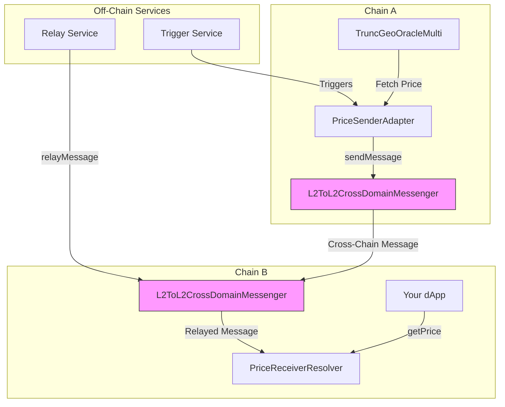

# 📡 AnyPrice — Unified Cross-Chain Oracle Access

**⚡ Fetch real-time asset prices from any chain, using a single call. Modular. Composable. No lock-in.**

## 🚀 What It Does

AnyPrice is a cross-chain oracle framework that lets your dApp on Optimism (or any L2) fetch price data from remote chains like UniChain as if it were local.

### Use Case

You're on Optimism. The asset you want to price only has liquidity on UniChain.

**Normally? You'd need to:**
* Bridge data manually
* Set up custom relayers
* Handle async flows
* Deal with mismatched oracle formats

**With AnyPrice, you just call:**

```solidity
CrossChainPriceResolver.resolvePrice("TOKEN", uniChainId);
```

✅ You get a fresh, validated price  
✅ Backed by registered oracle adapters  
✅ Delivered cross-chain via L2-native messaging

## 🧱 How It Works

### 🛰 1. Source Oracle & Sender (Chain A)

Each source chain (e.g., Base Sepolia) runs the core pricing logic (like `TruncGeoOracleMulti`) and a `PriceSenderAdapter` contract.

When triggered (e.g., by an off-chain service or keeper), the `PriceSenderAdapter`:
* Fetches the latest price data from the local oracle (`TruncGeoOracleMulti`).
* Formats the price update data into a message payload.

### 🔁 2. L2-to-L2 Cross-Chain Messaging

The `PriceSenderAdapter` directly calls the `sendMessage` function on Optimism's canonical `L2ToL2CrossDomainMessenger` predeploy contract (`0x42...23`) deployed on Chain A.

This message targets the `PriceReceiverResolver` contract deployed on the destination chain (Chain B, e.g., OP Sepolia).

Message relaying (execution on Chain B) can happen automatically via network relayers (like in `supersim --autorelay` mode) or require manual relaying by an off-chain service (like the provided `price-relay-service`) calling `relayMessage` on the messenger contract on Chain B.

### 🧠 3. Price Reception & Validation (Chain B)

The `PriceReceiverResolver` contract on Chain B is designed to receive messages *exclusively* from the `L2ToL2CrossDomainMessenger` predeploy on its own chain.

When a relayed message arrives:
* It checks `msg.sender` to ensure the call comes from the legitimate L2-L2 messenger.
* It uses `messenger.crossDomainMessageContext()` to securely identify the original sender contract address and chain ID (Chain A).
* It validates that the sender contract on Chain A is registered and authorized.
* It performs freshness checks on the price data timestamp.
* If valid, it stores the price data locally, keyed by source chain ID and pool ID.

Your dApp on Chain B can then simply call `PriceReceiverResolver.getPrice(sourceChainId, poolId)` to retrieve the validated, cross-chain price data.

## 📦 Architecture Overview



## 🎬 Demo Video

Watch a demonstration of AnyPrice in action:

[Watch the AnyPrice Demo on Loom](https://www.loom.com/share/f2402602fc534d9eafdf477428d8d53b?sid=0282eb3b-5422-4167-9516-a8375963c187)

## 🛠 Contracts Breakdown

| Contract                                | Purpose                                                    |
|-----------------------------------------|------------------------------------------------------------|
| `PriceReceiverResolver.sol`             | Receives, validates, and stores prices on destination chain |
| `PriceSenderAdapter.sol`                | Fetches prices and sends messages on source chain          |
| `L2ToL2CrossDomainMessenger (Predeploy)`| Optimism contract handling L2-to-L2 message passing      |
| `TruncGeoOracleMulti.sol`               | Core oracle logic providing price data on source chain     |
| `TruncOracleIntegration.sol`            | Example integration using the oracle system (if still used)|
| `DeployL2L2.s.sol`                      | Foundry script for deploying contracts across two L2s      |
| `script/price-relay-service/`           | Off-chain service for manually relaying messages           |

## 🧪 Running the Demo

### Prerequisites
* Foundry installed (`forge --version`)
* Node.js (v18+) & npm installed (`node --version`, `npm --version`)
* Access to RPC endpoints for two OP Stack L2 chains (e.g., OP Sepolia and Base Sepolia for testing).
* A deployer private key with test ETH on both chains.
* The `TruncGeoOracleMulti` contract must be deployed on Chain A.

### Environment Setup

1.  **Copy `.env.example` to `.env`**: Create a `.env` file in the project root.
2.  **Fill `.env` variables**:
    *   `PRIVATE_KEY`: Your deployer private key.
    *   `RPC_URL_A`: RPC URL for the source chain (where SenderAdapter will be deployed).
    *   `RPC_URL_B`: RPC URL for the destination chain (where ReceiverResolver will be deployed).
    *   `CHAIN_ID_B`: The chain ID number for Chain B.
    *   `TRUNC_ORACLE_MULTI_ADDRESS_A`: The address of the pre-deployed `TruncGeoOracleMulti` contract on Chain A.
    *   (Optional Etherscan keys for verification if deploying to public testnets)

### Deployment

Run the deployment script. This will deploy the `PriceReceiverResolver` to Chain B and the `PriceSenderAdapter` to Chain A, linking them together.

```bash
source .env # Load environment variables
forge script script/DeployL2L2.s.sol --broadcast --rpc-url $RPC_URL_A 
# Note: The script internally switches RPCs using vm.createSelectFork
# Add --verify if deploying to networks supported by Etherscan and keys are in .env
```

Take note of the deployed contract addresses printed by the script.

### Relaying Messages

The L2-to-L2 messenger requires messages to be relayed from Chain A to Chain B. You have two options:

1.  **Autorelay (Local Testing):** If using a local setup like `supersim`, run it with the `--interop.autorelay` flag. Messages will be relayed automatically.
2.  **Manual Relay:** For testnets or production, you need to run a relay service.
    *   Navigate to the service directory: `cd script/price-relay-service`
    *   Create a `.env` file in this directory, copying relevant variables from the root `.env` (like `PRIVATE_KEY`, `RPC_URL_A`, `RPC_URL_B`) and adding the deployed contract addresses:
        *   `PRICE_SENDER_ADAPTER_ADDRESS_A=<address from deployment>`
        *   `PRICE_RECEIVER_RESOLVER_ADDRESS_B=<address from deployment>`
        *   `CHAIN_NAME_A=<viem chain name, e.g., optimismSepolia>`
        *   `CHAIN_NAME_B=<viem chain name, e.g., baseSepolia>`
    *   Run the service: `npm start`
    *   **Note:** The provided `index.ts` is a basic example. You need to implement the logic to trigger the `sendAndRelayPrice` function based on your needs (e.g., periodically call `PriceSenderAdapter.publishPriceData` on Chain A, then relay). 

### Triggering a Price Update (Example)

Once deployed and with relaying handled (auto or manual), you can trigger a price update by calling `publishPriceData` or `publishPoolData` on the `PriceSenderAdapter` contract deployed on Chain A. This requires configuring `cast` or another tool with Chain A's RPC and the owner's private key.

```bash
# Example using cast - replace placeholders
POOL_ID=0x...
SENDER_ADAPTER_ADDR=<address from deployment>
OWNER_PK=$PRIVATE_KEY
RPC_A=$RPC_URL_A
TICK=...
SQRT_PRICE=...
TIMESTAMP=$(date +%s)

cast send --private-key $OWNER_PK --rpc-url $RPC_A \
  $SENDER_ADAPTER_ADDR "publishPriceData(bytes32,int24,uint160,uint32)" \
  $POOL_ID $TICK $SQRT_PRICE $TIMESTAMP
```

### Reading the Price

Your dApp (or a script) on Chain B can read the latest relayed price using the `PriceReceiverResolver` contract.

```bash
# Example using cast - replace placeholders
RESOLVER_ADDR=<address from deployment>
RPC_B=$RPC_URL_B
SOURCE_CHAIN_ID_A=...
POOL_ID=0x...

# Call getPrice(uint256 sourceChainId, bytes32 poolId)
cast call --rpc-url $RPC_B $RESOLVER_ADDR "getPrice(uint256,bytes32)" $SOURCE_CHAIN_ID_A $POOL_ID
```

The result will be the `PriceData` struct containing the tick, sqrtPriceX96, timestamp, and validity flag.

## 🧠 Why This Matters

| Feature | AnyPrice | Chainlink CCIP | Custom Relayers |
|---------|----------|----------------|-----------------|
| Modular Oracle Adapters | ✅ | ❌ | ❌ |
| Works Across Any L2 | ✅ | ❓ | ✅ |
| Native Oracle Format Support | ✅ | ❌ | ❓ |
| Dev UX: Single Function Call | ✅ | ❌ | ❌ |

## 💡 Extending It
* Add adapters for Chainlink, Pyth, custom oracles
* Plug into any app that uses price feeds (DEX, lending, liquidation bots)
* Swap messaging layer with CCIP, Hyperlane, LayerZero if needed

## 🏁 Final Thoughts

AnyPrice makes cross-chain price feeds composable, modular, and dev-friendly.

* No more waiting for someone to deploy Chainlink on your favorite L2.
* No more brittle relayer scripts.
* Just plug in and price.

## 🔒 Security Overview

The AnyPrice Oracle system, using the L2-to-L2 pattern, incorporates several security measures:

### Cross-Chain Message Security

- **L2ToL2CrossDomainMessenger Authentication**: The `PriceReceiverResolver` ensures that incoming price update calls originate *only* from the canonical `L2ToL2CrossDomainMessenger` predeploy address on its chain (`msg.sender == Predeploys.L2_TO_L2_CROSS_DOMAIN_MESSENGER`).
- **Original Sender Verification**: Uses `messenger.crossDomainMessageContext()` within the receiver to securely retrieve the authentic address of the `PriceSenderAdapter` contract on the source chain and the source chain ID.
- **Source Address Validation**: The `PriceReceiverResolver` verifies that the retrieved sender address and chain ID correspond to a registered and authorized source adapter in its `validSources` mapping.
- **Message Relay Security**: The security of message relay (whether automatic or manual) relies on the underlying Optimism protocol mechanisms that validate message proofs and prevent invalid relays.
- **Replay Protection**: The `L2ToL2CrossDomainMessenger` itself enforces nonce-based replay protection, ensuring each message from a specific sender can only be relayed once.

### Data Integrity Protections

- **Stale Data Prevention**: The `PriceReceiverResolver` rejects price data where the timestamp is older than a configurable `freshnessThreshold` (plus chain-specific buffer), preventing the use of outdated prices.
- **Timestamp Validation**: Checks ensure received timestamps are not in the future relative to the receiving chain's block timestamp.

### Access Controls

- **Source Registration**: Only authorized adapters registered via `PriceReceiverResolver.registerSource` (an `onlyOwner` function) can have their messages processed.
- **Sender Triggering**: The `PriceSenderAdapter`'s `publishPriceData` and `publishPoolData` methods are `onlyOwner`, ensuring only authorized accounts/contracts can initiate price sends.
- **Admin Functions**: Owner-only functions control source registration, freshness thresholds, chain buffers, and pausing.
- **Circuit Breaker**: The `PriceReceiverResolver` includes OpenZeppelin's `Pausable` mechanism to halt price updates during emergencies.

### Implementation Safeguards

- **Reentrancy Protection**: The `PriceReceiverResolver` uses OpenZeppelin's `ReentrancyGuard`.
- **Strict Validation**: The receiver performs checks on sender validity and timestamp freshness.
- **Chain-Specific Time Buffers**: Configurable buffers account for potential block time differences.

### Security Best Practices

- **Immutable Core Components**: References to the messenger, oracle, target chain/address are immutable.
- **Defensive Programming**: Uses custom error types and checks.
- **Event Emission**: Events log successful updates and administrative changes.

### Known Limitations

- **Cross-Chain Messaging Dependency**: Relies on the security and liveness of the Optimism `L2ToL2CrossDomainMessenger` protocol and its relayers.
- **Oracle Data Quality**: Depends on the accuracy and reliability of the `TruncGeoOracleMulti` implementation on the source chain.
- **Block Timestamp Reliance**: Freshness checks depend on block timestamps, which have minor manipulability potential.

For security disclosures or concerns, please contact the project maintainer directly.

## 👨‍💻 Author

Built for the Unichain x Optimism Hackathon  
By Bryan Gross — [@bryangross on X](https://twitter.com/bryangross)
