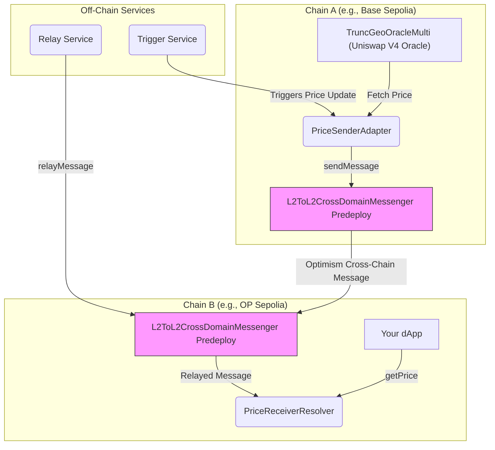

# 📡 AnyPrice — Unified Cross-Chain Oracle Access

**⚡ Fetch real-time asset prices from any chain, using a single call. Modular. Composable. No lock-in.**

## 🎯 Problem

Accessing up-to-date price oracle data across different blockchain ecosystems (especially L2s) is fragmented and complex. dApps on one chain (e.g., Optimism) often need price data for assets whose primary liquidity and reliable oracle source exist on another chain (e.g., a different OP Stack chain, or potentially Uniswap V4 on Ethereum L1 in the future). Standard solutions involve cumbersome bridging, custom relayers, or reliance on centralized oracle providers who may not support all desired chains or assets immediately.

## ✨ Solution: AnyPrice

AnyPrice is a cross-chain oracle framework enabling dApps on Optimism (or any L2) to fetch price data from remote chains *as if it were local*.

**Example:** You're on OP Sepolia. The asset you need to price only has a reliable Uniswap V4 oracle (`TruncGeoOracleMulti`) deployed on Base Sepolia.

**With AnyPrice, you just call:**

```solidity
// In your contract on OP Sepolia
CrossChainPriceResolver.resolvePrice("TOKEN_POOL_ID", baseSepoliaChainId); 
```

✅ You get a fresh, validated price from Base Sepolia.  
✅ Data sourced from a registered, chain-specific oracle adapter (`PriceSenderAdapter`).  
✅ Delivered securely and efficiently via Optimism's native L2-to-L2 messaging.

## 🔗 Hackathon Relevance (Optimism x Uniswap Interoperability)

AnyPrice directly addresses the hackathon theme by demonstrating powerful interoperability:

1. **Optimism Native Messaging:** Leverages the canonical `L2ToL2CrossDomainMessenger` predeploy for secure and efficient data transfer *between* Optimism ecosystem chains (OP Stack L2s). This showcases a core piece of Optimism's interoperability infrastructure.
2. **Uniswap V4 Oracle Integration:** Consumes price data from `TruncGeoOracleMulti`, a custom Uniswap V4 compatible oracle designed for multi-pool TWAP-like data with manipulation resistance (via truncated observations). This demonstrates accessing and utilizing next-generation Uniswap oracle data across chains.
3. **Modular Design:** The adapter pattern (`PriceSenderAdapter`, `PriceReceiverResolver`) allows integrating *any* source oracle and potentially *any* messaging layer, promoting a composable cross-chain future.

## 🧱 How It Works

### 🛰 1. Source Oracle & Sender (Chain A - e.g., Base Sepolia)

* A source oracle (here, `TruncGeoOracleMulti`, compatible with Uniswap V4 pools) provides price data.
* The `PriceSenderAdapter` contract is deployed on Chain A.
* When triggered (e.g., off-chain keeper), `PriceSenderAdapter`:
  * Fetches the latest price from `TruncGeoOracleMulti`.
  * Formats it into a message payload.
  * Calls `sendMessage` on Chain A's `L2ToL2CrossDomainMessenger` predeploy.

### 🔁 2. L2-to-L2 Cross-Chain Messaging (Optimism Protocol)

* The message from Chain A's messenger is routed to Chain B's (e.g., OP Sepolia) `L2ToL2CrossDomainMessenger`.
* This relies on Optimism's underlying cross-chain communication infrastructure.
* Message relaying (execution on Chain B) can be automatic (e.g., local `supersim --autorelay`) or require manual relaying via an off-chain service calling `relayMessage` on Chain B's messenger.

### 🧠 3. Price Reception & Validation (Chain B - e.g., OP Sepolia)

* The `PriceReceiverResolver` contract is deployed on Chain B.
* It receives the message *only* from Chain B's `L2ToL2CrossDomainMessenger`.
* It validates:
  * `msg.sender` is the official L2-L2 messenger.
  * The original sender on Chain A (`PriceSenderAdapter`) and source Chain ID are registered/authorized.
  * The price data timestamp is fresh (not stale or future-dated).
* If valid, it stores the price locally.
* Your dApp on Chain B calls `PriceReceiverResolver.getPrice(...)` to access the data.

## 📦 Architecture Overview



## 🎬 Demo Video

Watch a demonstration of AnyPrice in action:

[Watch the AnyPrice Demo on Loom](https://www.loom.com/share/f2402602fc534d9eafdf477428d8d53b?sid=0282eb3b-5422-4167-9516-a8375963c187)

## 🚀 Running the Demo

You can run AnyPrice in two ways:
1. **Local Development** using `supersim` (recommended for testing)
2. **Testnet Deployment** using OP Sepolia and Base Sepolia

### Local Development with Supersim

This is the fastest way to test AnyPrice without needing testnet ETH or faucets:

1. **Install Dependencies**
```bash
# Install Foundry
curl -L https://foundry.paradigm.xyz | bash
foundryup

# Install Node.js dependencies
npm install

# Install supersim
brew install ethereum-optimism/tap/supersim
```

2. **Start Local L2 Chains**
```bash
# Start two L2 chains with auto-relaying enabled
supersim --l2.count 2 --l2.starting.port 9545 --interop.autorelay
```

3. **Configure Environment**
Create a `.env` file:
```bash
# Dev key that supersim prefunds
PRIVATE_KEY=0xac0974bec39a17e36ba4a6b4d238ff944bacb478cbed5efcae784d7bf4f2ff80

# Supersim RPC URLs
RPC_URL_A=http://127.0.0.1:9545
RPC_URL_B=http://127.0.0.1:9546

# Supersim chain IDs
CHAIN_ID_A=901
CHAIN_ID_B=902

# Will be filled after mock oracle deployment
TRUNC_ORACLE_MULTI_ADDRESS_A=

# Not needed for local dev
ETHERSCAN_API_KEY_A=
ETHERSCAN_API_KEY_B=
```

4. **Deploy Contracts**
```bash
# Deploy mock oracle to Chain A
forge script script/DeployMockOracle.s.sol --broadcast --rpc-url $RPC_URL_A
# Copy the deployed address to TRUNC_ORACLE_MULTI_ADDRESS_A in .env

# Deploy main contracts
forge script script/DeployL2L2.s.sol --broadcast --rpc-url $RPC_URL_A
```

5. **Test Price Updates**
```bash
# Get the deployed contract addresses
SENDER=<PriceSenderAdapter address from deploy output>
RESOLVER=<PriceReceiverResolver address from deploy output>

# Send a price update from Chain A
cast send --private-key $PRIVATE_KEY --rpc-url $RPC_URL_A $SENDER "publishPriceData(bytes32,int24,uint160,uint32)" \
  0x0101010101010101010101010101010101010101010101010101010101010101 12345 5678901234567890123456789012 $(date +%s)

# Read the price on Chain B
cast call --rpc-url $RPC_URL_B $RESOLVER "getPrice(uint256,bytes32)(int24,uint160,uint32,bool)" \
  901 0x0101010101010101010101010101010101010101010101010101010101010101
```

### Testnet Deployment

For deploying to actual testnets, follow the detailed instructions in:

➡️ **[SETUP.md](./SETUP.md)** ⬅️

##  Running the Demo

Detailed instructions for setting up the environment, deploying the contracts, running the relay service, and interacting with the system can be found in the dedicated setup guide:

➡️ **[SETUP.md](./SETUP.md)** ⬅️

Following that guide will walk you through:
1. Setting up your environment variables (`.env`).
2. Deploying the `PriceSenderAdapter` and `PriceReceiverResolver` contracts.
3. Running the necessary message relaying service.
4. Manually triggering price updates and reading them on the destination chain using `cast`.

### Prerequisites Overview
* Foundry (`forge`)
* Node.js (`node`, `npm`)
* RPC endpoints for two OP Stack L2 testnets (e.g., OP Sepolia & Base Sepolia)
* A funded deployer wallet private key
* **Crucially:** An address for a deployed `TruncGeoOracleMulti` contract on the source chain (Chain A). See [SETUP.md](./SETUP.md) for details on handling this dependency during testing.

## 🛠 Contracts Breakdown

| Contract                       | Chain | Purpose                                                                 | Key Features                                                              |
|--------------------------------|-------|-------------------------------------------------------------------------|---------------------------------------------------------------------------|
| `PriceReceiverResolver.sol`    | B     | Receives, validates, stores prices                                      | L2-L2 Messenger Auth, Sender Validation, Freshness Check, `getPrice`      |
| `PriceSenderAdapter.sol`       | A     | Fetches oracle prices, sends messages via L2-to-L2 Messenger             | Interfaces w/ Oracle, Calls `sendMessage`, `publishPriceData`             |
| `TruncGeoOracleMulti.sol`      | A     | **(External)** Uniswap V4 Oracle providing TWAP-like data            | Multi-pool, Manipulation-resistant (Truncated Obs), Source of Truth     |
| `TruncOracleIntegration.sol`   | A     | (Example) Connects Oracle to Sender Adapter, manages publishing       | Ownable, Authorization logic, Pool state tracking                         |
| `DeployL2L2.s.sol`             | -     | Foundry script for deploying Adapter (A) & Resolver (B)                 | Reads `.env`, Handles cross-chain deployment logic                        |
| `script/price-relay-service/`  | -     | Off-chain Node.js service for manual message relaying (Example)         | Polls Sender, Calls `relayMessage` on Chain B Messenger                     |
| `L2ToL2CrossDomainMessenger`   | A & B | **(Optimism Predeploy)** Canonical contract handling L2-to-L2 messaging | `sendMessage`, `relayMessage`, Secure cross-domain context propagation    |


## 🔒 Security Overview

AnyPrice relies on the security of the underlying Optimism L2-to-L2 messaging protocol and incorporates these key contract-level safeguards:

* **Messenger Authentication:** `PriceReceiverResolver` only accepts messages from the official `L2ToL2CrossDomainMessenger` predeploy on its chain.
* **Source Validation:** The receiver uses `crossDomainMessageContext()` to verify the message originates from a registered `PriceSenderAdapter` address on the expected source chain ID. Registration is owner-controlled.
* **Freshness Checks:** The receiver rejects stale data based on timestamps and configurable thresholds (`freshnessThreshold`), mitigating replay of old prices.
* **Access Controls:** Sensitive functions like source registration (`registerSource`) and triggering price sends (`publishPriceData`) are owner-restricted.
* **Reentrancy Guard:** Used in `PriceReceiverResolver` to prevent reentrancy attacks.
* **Oracle Data Quality:** The system's accuracy depends on the reliability and security of the source oracle (`TruncGeoOracleMulti`) on Chain A.
* **Dependencies:** Relies on the security and liveness of Optimism's L2 messaging infrastructure and relayers.

## 🏁 Final Thoughts

AnyPrice offers a modular, developer-friendly approach to cross-chain price feeds within the Optimism ecosystem and beyond, leveraging native L2 interoperability and next-generation Uniswap V4 oracle capabilities.

## 👨‍💻 Author

Built for the Unichain x Optimism Hackathon  
By Bryan Gross — [@bryangross on X](https://twitter.com/bryangross)
